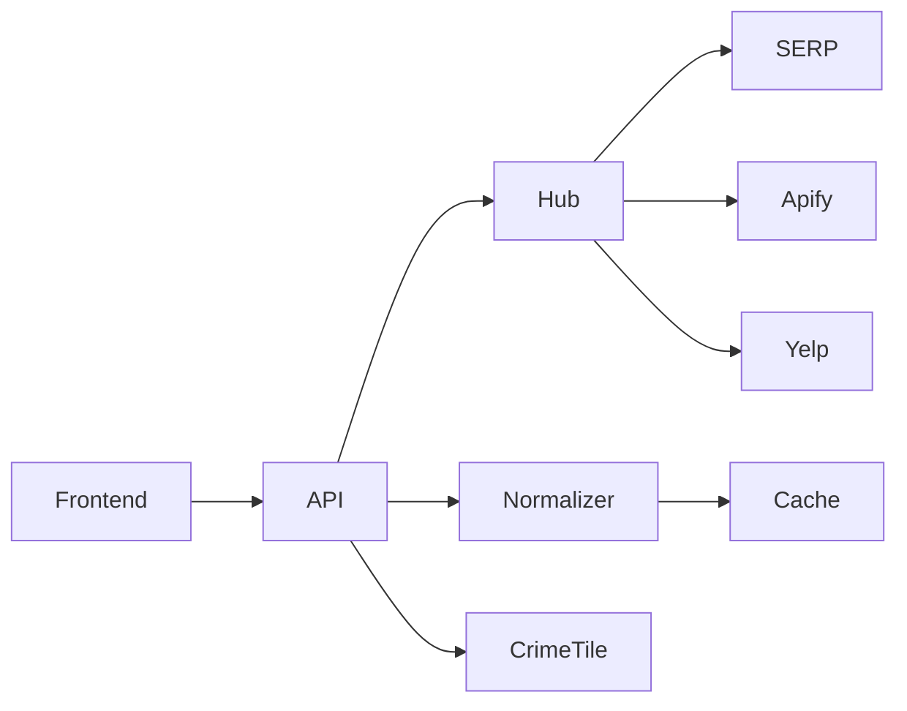

# Okapiq — Backend System Architecture (Simplified)

Short, focused description of the backend for the Okapiq market scanner.
---

## Overview

The backend is a FastAPI service that:
- accepts scan requests from the frontend
- runs multiple source agents (Google SERP, Apify, Yelp, etc.)
- normalizes and enriches results (websites, phones, ratings)
- returns structured business records for the UI and caches results for speed

Design goals: reliability, real-data aggregation (no mocks), and responsive APIs for the UI.
---

## High-level Components

- **FastAPI** — public API (scan, tiles, health). Orchestrates the scan flow.
- **SmartCrawlerHub** — runs source agents (SERP, Apify, Yelp, Firecrawl) and aggregates results.
- **Normalizer** — deduplicates and converts raw results into canonical business objects (address, contact, metrics).
- **Enricher** — runs targeted SERP queries and website crawls to add websites, emails, phones.
- **Crime Tile Generator** — produces PNG tiles for the map overlay.
- **Storage & Cache** — PostgreSQL (persistent) and Redis (caching & rate limiting).
- **Frontend (Next.js)** — consumes APIs and renders result cards and map overlays.
---

## Data Flow (short)

1. Frontend calls `POST /intelligence/scan`.
2. Backend runs the SmartCrawlerHub (SERP first, then other agents) and aggregates source outputs.
3. Normalizer deduplicates and standardizes results.
4. Enricher runs quick SERP lookups to add websites (and schedules deep crawls if needed).
5. Results are returned to the frontend; cached in Redis for repeat requests.
---

## Key Endpoints

- `POST /intelligence/scan` — run a scan and return normalized businesses.
- `GET /analytics/crime-tiles/{z}/{x}/{y}` — PNG crime heatmap tile.
- `GET /health` — service health status.
---

## Important Modules

- `app.routers.intelligence` — request validation, orchestration, normalization pipeline.
- `app.crawlers.smart_crawler_hub` — central interface for all crawler agents; returns per-source results.
- `app.processors.data_normalizer` — canonical business object normalization and metric calculations.
- `app.routers.analytics` / `test_crime_api.py` — crime tile generation and visualization.
- `app/core/config.py` — central settings (Pydantic) reading `.env` and exposing api keys.

---

## Config

- All keys and settings live in `.env` and are exposed via `app/core/config.py`'s `Settings`.

Keep production secrets out of repo and use a secret manager in production.
---

## Scalability

- Cache scan results in Redis.
- Offload long-running crawls to external actors or background workers.
- Run multiple backend workers behind a load balancer for scale.
---

## Monitoring

- Logs, metrics (latency, success/failure), and traces for critical flows.
---

## Deployment

- Dev: `uvicorn main:app --reload`; Frontend: `npm run dev`.
- Prod: multiple workers behind LB, HTTPS, secrets via vault/secret manager.
---

## Architecture diagram

---

## LLM Integration via Supabase Edge Functions

Simplified integration pattern to let an LLM call external providers reliably:

- Wrap each external provider in a Supabase Edge Function. Each function:
  - validates inputs, calls provider, normalizes results, upserts to Supabase Postgres, returns compact JSON.
- Expose the Edge Functions as callable tools the LLM can invoke.
- Flow:
  1. User asks the LLM a question.
  2. LLM selects a tool (Edge Function) and calls it with structured arguments.
  3. Edge Function fetches provider data, normalizes it, upserts into Postgres, returns JSON.
  4. LLM reads table rows (via Supabase API) to build context and returns a summary to the UI.

Benefits: centralizes provider logic, secures API keys at the edge, and produces canonical rows LLM can query.

## Next steps

- Add background worker for deep crawling and email extraction.
- Add tracing and dashboards for crawler health and enrichment coverage.

---

Document: `docs/backend_system_architecture.md` (simplified)

---

Document created: `docs/backend_system_architecture.md`

